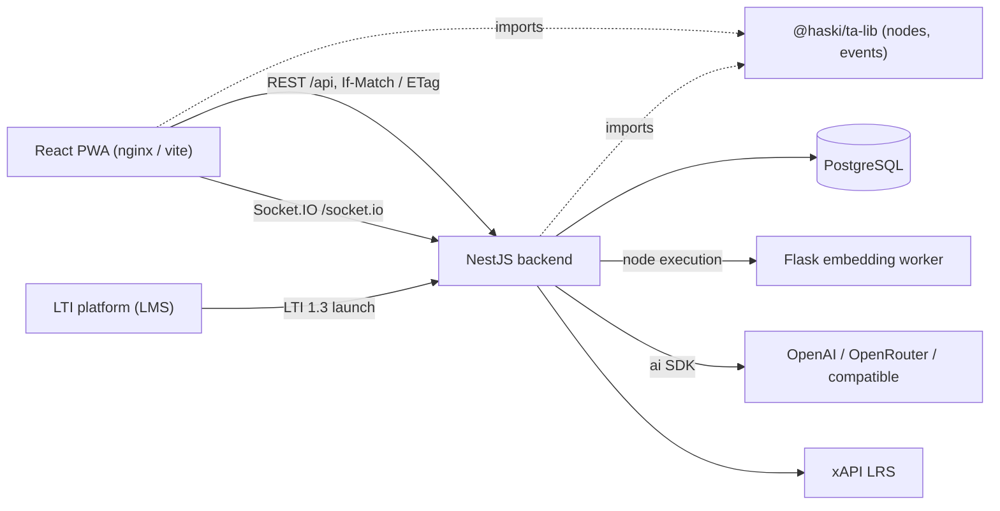
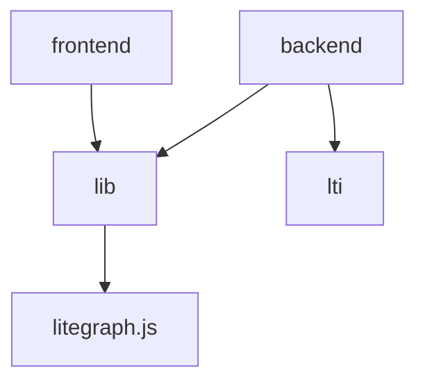
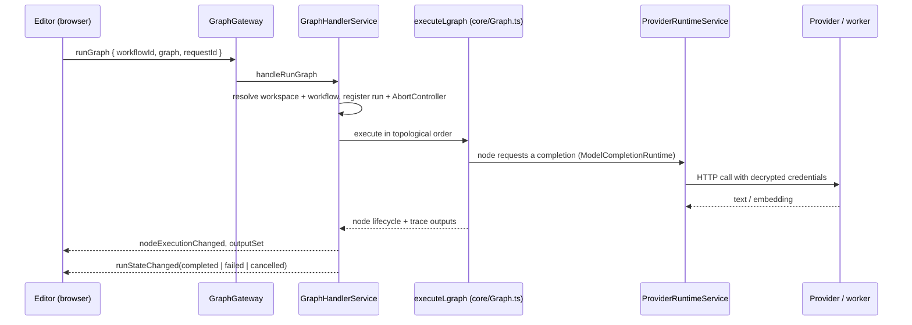
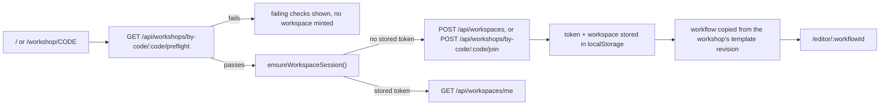

# Architecture

How NodeGrade fits together at runtime. For where code lives, read
`docs/module-map.md`; for decision rationale, `docs/adr/`.

## Runtime components

Node implementations are shared source, not a service: the browser draws and validates
the same node classes the server executes. That is why `@haski/ta-lib` may not depend on
either application, and why both consume it from `packages/lib/dist`.

## Dependency direction

`packages/lib` and `packages/lti` never import the applications. Inside the backend,
controllers hold no domain logic: they validate DTOs, resolve the caller through a guard,
and delegate to a service, which is the only layer that touches Prisma.

## Two authorization surfaces

| Surface | Caller | Credential | Guard |
|---|---|---|---|
| Participant (`/api/workspaces`, `/api/workflows`, `/api/workshops/by-code/**`, Socket.IO) | browser, LTI launch | `Authorization: Bearer <workspace token>`, or the LTI launch cookie | `WorkspaceGuard` |
| Facilitator (`/api/admin/**`, `/api/providers`, `/api/benchmark/run`) | admin UI | session cookie + `X-CSRF-Token` | `AdminSessionGuard` |

A bearer token cannot be set by a cross-site form post, which keeps CSRF handling off the
participant surface entirely. Workspace ids appear in URLs and are never credentials
(ADR-0001).

## Two transports

REST persists, Socket.IO executes (ADR-0002).

- Saves are `PUT /api/workflows/:id` with `If-Match: <version>`; the response carries the
  new `ETag`, and a version mismatch is reported as a conflict the editor surfaces rather
  than overwriting.
- Runs are `runGraph`/`cancelRun` socket messages carrying the serialized graph and a
  workspace-scoped `workflowId`. Progress comes back as `runStateChanged`,
  `nodeExecutionChanged`, `outputSet` and `graphFinished` events typed in
  `packages/lib/src/events/ServerEvents.ts`.

## Execution flow

Credentials never reach a node: nodes hold a `ModelCompletionRuntime` reference, and the
runtime resolves a `ModelRef` (`providerKey` + model id) to a provider and its decrypted
key (ADR-0005). Trace outputs pass through `core/trace-sanitizer.ts` before leaving the
process. A socket disconnect aborts that client's runs.

Two server-side gates sit on that path. Each provider carries a model policy, and
`ProviderRuntimeService` applies it twice: the catalog `GET /api/models` returns only
permitted models, and `complete()` refuses a `ModelRef` the policy excludes before any
request leaves the process, so client-side filtering is never the enforcement. Concurrency
is bounded on both sides of the socket: `GraphHandlerService` caps the runs one workspace
may have in flight, and `ProviderRuntimeService` holds a deployment-wide permit gate in
front of provider requests. Both limits live in the `ExecutionLimits` singleton row and are
re-read per request, so a facilitator change applies without a restart.

## Participant entry flow

Workshop entry is preflighted before anyone is started into it: `WorkshopReadinessService`
checks the backend, the workshop's template revision, whether this build registers the node
types that revision needs, and whether a reachable provider offers a model the policy
permits. Facilitators run the same checks from the admin workshop list.

Joining a published workshop code mints a `WORKSHOP` workspace and copies the workshop's
template revision into a fresh workflow, so participants never share state. A token the
server no longer honours (retention sweep, reset database) is discarded and replaced
instead of stranding the participant.

## Persistence

PostgreSQL through Prisma 7; the client is generated into
`packages/backend/src/generated/prisma`. Notable shapes:

- Graph content is stored as **text**, not `jsonb`, so copies and backfills cannot reorder
  keys.
- `Workflow.version` is the optimistic concurrency counter carried as an `ETag`;
  `publishedContent` is the student-visible projection (ADR-0007).
- `TemplateRevision` rows are immutable; `Template.currentRevision` is a number, not a
  foreign key, so creating revision N+1 inside a transaction is race-free (ADR-0003).
- Only SHA-256 hashes of workspace tokens, admin session cookies and CSRF tokens are
  stored. Provider API keys are AES-256-GCM ciphertext in `Provider.apiKeyEnc`.
- `LegacyGraph` and `Workflow.legacyPath` remain until the pre-workspace rows are retired
  (ADR-0004).

## Boot lifecycle

`main.ts` wires the cookie-forwarding WebSocket adapter, `trust proxy`, an 8 MB JSON body
limit, the global `api` prefix (excluding `GET /health` and `POST /lti/basiclogin`), a
whitelisting `ValidationPipe`, and CORS with credentials.

`OnApplicationBootstrap` work, all idempotent: `ProviderService` loads provider runtime
config and gives any policy-less provider the unchosen state, `ExecutionLimitsService`
materializes the limits row, `TemplateSeedService` seeds bundled templates, `ContentMigrationService` backfills
stored content to the current `contentSchema`, `RetentionService` starts its six-hour
sweep. Prisma connects on module init; `XapiService` opens its client on module init.

## Configuration

Backend reads the environment through `src/config/configuration.ts` (`@nestjs/config`,
cached): port, CORS origins, frontend URL, cookie insecurity switch, node run timeout,
worker URLs, xAPI credentials. Read directly from the environment elsewhere:
`DATABASE_URL` (Prisma), `ADMIN_USERNAME`/`ADMIN_PASSWORD` (facilitator login),
`PROVIDER_ENCRYPTION_KEY` (credential cipher), `CONTENT_MIGRATION_ENABLED`. See
`.env_template`.

The frontend has no build-time API constant: `src/utils/config.ts` fetches
`public/config/env.<mode>.json` at runtime, so one image serves several deployments. In
development Vite proxies `/api` to `http://localhost:5000`.

## Deployment topology

`docker-compose.yml` runs three services: Postgres, the backend image
(`node dist/src/main.js` after `prisma migrate deploy`), and an nginx image serving the
built PWA as static files with SPA fallback. The nginx layer does not proxy the API — the
browser reaches the backend at the URL in the runtime config file.

`docker-compose.debug.yml` plus `tools/debug/stack.mjs` reproduce the whole stack
deterministically on the 15xxx/18000 port range with a fake model worker, a seeded demo
graph, a published workshop code and an exposed Node inspector; Playwright drives it. See
`docs/debugging.md`.
