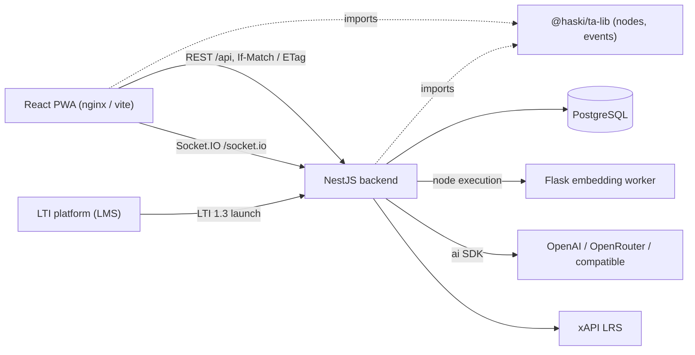
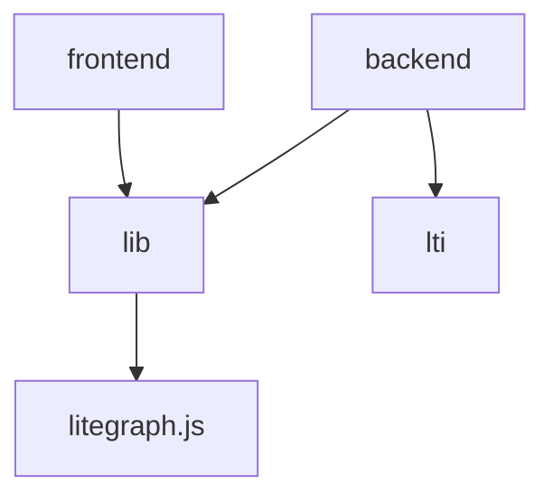
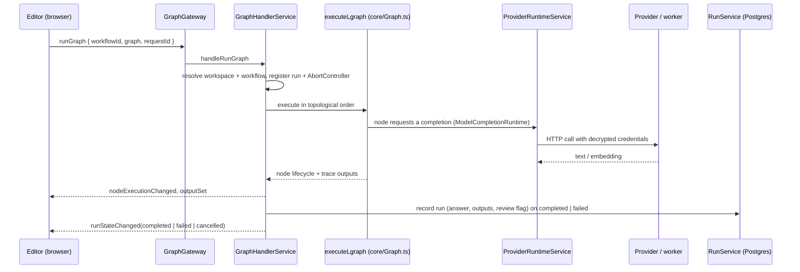
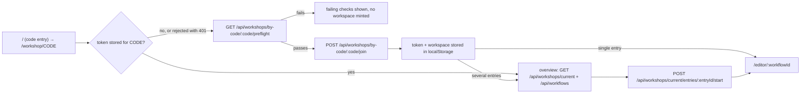

# Architecture

How NodeGrade fits together at runtime. For where code lives, read
`docs/module-map.md`; for decision rationale, `docs/adr/`.

## Runtime components

Node implementations are shared source, not a service: the browser draws and validates
the same node classes the server executes. That is why `@haski/ta-lib` may not depend on
either application, and why both consume it from `packages/lib/dist`.

## Dependency direction

`packages/lib` and `packages/lti` never import the applications. Inside the backend,
controllers hold no domain logic: they validate DTOs, resolve the caller through a guard,
and delegate to a service, which is the only layer that touches Prisma.

## Two authorization surfaces

| Surface | Caller | Credential | Guard |
|---|---|---|---|
| Participant (`/api/workspaces/me`, `/api/workflows/**`, `/api/templates` (blocks only), `/api/workshops/current/**`, Socket.IO) | workshop participant, LTI launch | `Authorization: Bearer <workspace token>`, or the LTI launch cookie | `WorkspaceGuard` |
| Workshop entry (`/api/workshops/by-code/:code`, `.../preflight`, `.../join`) | anyone holding a code | none; `join` accepts the workshop's bearer token for a re-join | none — `join` is rate-limited per address |
| Facilitator (`/api/admin/**`, `/api/providers`, `/api/benchmark/run`) | admin UI | session cookie + `X-CSRF-Token` | `AdminSessionGuard` |

A bearer token cannot be set by a cross-site form post, which keeps CSRF handling off the
participant surface entirely. Workspace ids appear in URLs and are never credentials
(ADR-0001).

Participant workspaces come from exactly two places: a workshop join (`WORKSHOP`) and an
LTI launch (`LTI`). There is no anonymous workspace; `BROWSER` tokens issued before
SPEC-0022 are rejected (ADR-0010). Workflow templates reach a participant only as entries
of their own workshop; `/api/templates` serves the block library the editor palette
inserts from.

A workshop that is CLOSED or past its expiry is read-only for its participants.
`WorkspaceService.resolveByToken` carries the workshop's `readOnly` state, `WorkspaceGuard`
rejects every non-GET/HEAD request with 403 `workshop_closed`, and
`GraphHandlerService.handleRunGraph` re-reads the workshop state on every run, so a socket
opened before the close cannot keep running graphs.

## Two transports

REST persists, Socket.IO executes (ADR-0002).

- Saves are `PUT /api/workflows/:id` with `If-Match: <version>`; the response carries the
  new `ETag`, and a version mismatch is reported as a conflict the editor surfaces rather
  than overwriting.
- Runs are `runGraph`/`cancelRun` socket messages carrying the serialized graph and a
  workspace-scoped `workflowId`. Progress comes back as `runStateChanged`,
  `nodeExecutionChanged`, `outputSet` and `graphFinished` events typed in
  `packages/lib/src/events/ServerEvents.ts`.
- One deliberate crossing (ADR-0009): the run handler writes a `Run` record for every
  completed or failed execution before it emits the terminal event, and REST
  (`GET /api/workflows/:id/runs`, `PATCH .../runs/:runId/review`) reads and marks those
  records for the Submissions inbox. The trace is never stored.

## Execution flow

Credentials never reach a node: nodes hold a `ModelCompletionRuntime` reference, and the
runtime resolves a `ModelRef` (`providerKey` + model id) to a provider and its decrypted
key (ADR-0005). Trace outputs pass through `core/trace-sanitizer.ts` before leaving the
process. A socket disconnect aborts that client's runs.

Model selection falls back to the facilitator's deployment default: after the graph is
configured, `GraphHandlerService` substitutes the effective default into every LLM node
without an explicit `model_ref`, leaving stored workflow content untouched. The
participant catalog (`GET /api/models`) carries that default as `defaultModel` whenever
it is runnable, and in production the local model worker is filtered from the
participant catalog and refused at execution — facilitator views stay unfiltered.

Two server-side gates sit on that path. Each provider carries a model policy, and
`ProviderRuntimeService` applies it twice: the catalog `GET /api/models` returns only
permitted models, and `complete()` refuses a `ModelRef` the policy excludes before any
request leaves the process, so client-side filtering is never the enforcement. Concurrency
is bounded on both sides of the socket: `GraphHandlerService` caps the runs one workspace
may have in flight, and `ProviderRuntimeService` holds a deployment-wide permit gate in
front of provider requests. Both limits live in the `ExecutionLimits` singleton row and are
re-read per request, so a facilitator change applies without a restart.

## Participant entry flow

Workshop entry is preflighted before anyone is started into it: `WorkshopReadinessService`
checks the backend and then each entry — whether its template revision loads, whether this
build registers the node types it needs, and whether a reachable provider offers a model
the policy permits. The workshop fails only when the backend fails or no entry passes; an
entry failing its template or node-type check is shown unavailable, while a model problem
leaves it startable and surfaces at run time. Facilitators run the same checks from the
admin workshop list.

Joining a published workshop code mints a `WORKSHOP` workspace (rate-limited per address
by `WorkspaceCreationThrottle`); a re-join with the workshop's token returns the same
workspace. A single-entry workshop starts its entry at once and opens the copy in the
editor; otherwise the participant lands on the workshop overview (`WorkshopJoin.tsx`),
which lists the entries and the participant's own workflows. Starting an entry copies the
pinned revision, or the template's current revision for an entry that follows the newest
one, into a fresh workflow; starting it again opens the existing copy. Participants never
share state. A participant with a stored token goes straight to the overview, which still
answers read-only once the workshop has closed; a token the server no longer honours
(retention sweep, reset database) falls through to a fresh join instead of stranding the
participant.

## Persistence

PostgreSQL through Prisma 7; the client is generated into
`packages/backend/src/generated/prisma`. Notable shapes:

- Graph content is stored as **text**, not `jsonb`, so copies and backfills cannot reorder
  keys.
- `Workflow.version` is the optimistic concurrency counter carried as an `ETag`;
  `publishedContent` is the student-visible projection (ADR-0007).
- `TemplateRevision` rows are immutable; `Template.currentRevision` is a number, not a
  foreign key, so creating revision N+1 inside a transaction is race-free (ADR-0003).
- `WorkshopTemplate` holds a workshop's ordered entries, one per template: a null
  `templateRevisionId` follows the template's newest revision, a set one pins that
  revision. The legacy `Workshop.templateId`/`templateRevisionId` columns were backfilled
  into it, are nullable and unused, and are dropped by a later migration (SPEC-0022).
- Only SHA-256 hashes of workspace tokens, admin session cookies and CSRF tokens are
  stored. Provider API keys are AES-256-GCM ciphertext in `Provider.apiKeyEnc`.
- `LegacyGraph` and `Workflow.legacyPath` remain until the pre-workspace rows are retired
  (ADR-0004).
- `Run` holds one row per completed or failed execution: the answer, the sanitized
  outputs as `jsonb` (capped per value and per run), the derived review flag and the
  participant's review mark. Rows cascade with their workspace and workflow and are
  trimmed to the newest 200 per workflow (ADR-0009, SPEC-0020).
- `WorkflowVersion` holds the states a workflow has left: captured before the save that
  replaces them (coalesced to one per two minutes) and unconditionally before a reset or
  a restore. Rows cascade with their workflow and are trimmed to the newest 20 per
  workflow (SPEC-0021).

## Boot lifecycle

`main.ts` wires the cookie-forwarding WebSocket adapter, `trust proxy`, an 8 MB JSON body
limit, the global `api` prefix (excluding `GET /health` and `POST /lti/basiclogin`), a
whitelisting `ValidationPipe`, and CORS with credentials.

`OnApplicationBootstrap` work, all idempotent: `ProviderService` loads provider runtime
config and gives any policy-less provider the unchosen state, `ExecutionLimitsService`
materializes the limits row, `TemplateSeedService` seeds bundled templates, `ContentMigrationService` backfills
stored content to the current `contentSchema`, `RetentionService` starts its six-hour
sweep. Prisma connects on module init; `XapiService` opens its client on module init.

## Configuration

Backend reads the environment through `src/config/configuration.ts` (`@nestjs/config`,
cached): port, CORS origins, frontend URL, cookie insecurity switch, node run timeout,
worker URLs, xAPI credentials. Read directly from the environment elsewhere:
`DATABASE_URL` (Prisma), `ADMIN_USERNAME`/`ADMIN_PASSWORD` (facilitator login),
`KATALYST_API_KEY` (optional bundled KATALYST provider),
`PROVIDER_ENCRYPTION_KEY` (credential cipher), `CONTENT_MIGRATION_ENABLED`. See
`.env_template`.

The frontend has no build-time API constant: `src/utils/config.ts` fetches
`public/config/env.<mode>.json` at runtime, so one image serves several deployments. In
development Vite proxies `/api` to `http://localhost:5000`.

## Deployment topology

`docker-compose.yml` runs four services: Postgres, the sentence-transformer worker, the
backend image (`node dist/src/main.js` after `prisma migrate deploy`), and an nginx image
serving the built PWA as static files with SPA fallback. The nginx layer proxies `/api`,
`/socket.io`, `/lti`, and `/health` to the backend service, keeping browser traffic on the
frontend's public origin. The production runtime config therefore uses the relative
`/api` URL. `tools/stack.mjs` (`yarn dev:up`) drives that file, so a developer runs the
deployed topology with the real models by the same verbs as the debug stack.

`docker-compose.prod.yml` is that topology as deployed: the same four services, but the
backend, frontend and worker come as prebuilt images from GHCR
(`.github/workflows/deploy.yml` builds and pushes them on every push to `main`, then
calls the Portainer stack webhook), Traefik terminates TLS in front of the frontend's
nginx, and nothing else publishes a port. Configuration arrives from the Portainer stack
environment twice over: `${VAR}` substitution for what the compose file composes
(hostname, image tag, Traefik names, database URL) and a Portainer-written `stack.env`
that the backend loads whole, so a new backend variable needs no compose change. With
two proxies in the path the backend runs with `TRUST_PROXY=2` so throttles still see the
client address.

`docker-compose.debug.yml` plus `tools/debug/stack.mjs` reproduce the whole stack
deterministically on the 15xxx/18000 port range with a fake model worker, a seeded demo
graph, a published workshop code and an exposed Node inspector; Playwright drives it. See
`docs/debugging.md`.
